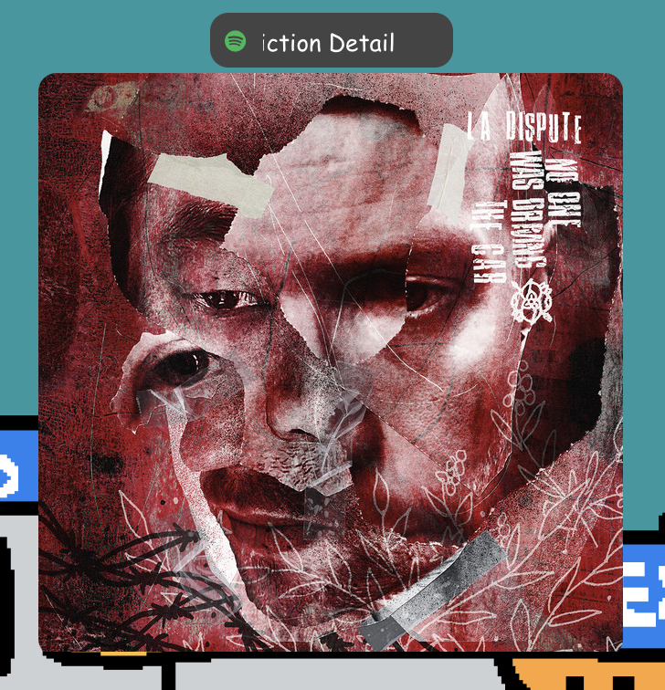

# ncspot-controller

A Rust service to monitor and control [ncspot](https://github.com/hrkfdn/ncspot) via its Unix socket interface. Much like `playerctl` but built specifically for ncspot, enabling CLI control of ncspot in MacOS.

## Why?

I built this so that I can integrate ncspot with [sketchybar](http://github.com/FelixKratz/SketchyBar) to show a song preview widget.  
It also allows for controlling ncspot's playback from the CLI, which unlocks various workflow integrations for users of MacOS who can't use `playerctl`, such as:

- Custom bar integrations ([like mine](https://github.com/Kainoa-h/MacSetup?tab=readme-ov-file#ncspot-controller--ncspot-controller--link-2-project))
- Controlling ncspot via CLI commands while its tucked away with tmux
- Controlling ncspot via Alfred/Raycast
- Whatever else you can think of...

## Features

- **Monitor mode**: Continuously monitor ncspot's playback state and execute hooks on state changes
- **Control mode**: Send commands to ncspot from the command line
- **Album Images**: Automatically (optionally) installs the current track album image to a temporary path




## Installation

```bash
brew tap kainoa-h/tap
brew install ncspot-controller
```

## Usage

### Monitor Mode

Run without any arguments to start monitoring ncspot:

```bash
ncspot-controller
```

Or, if installed vie brew, start as a service:

```bash
brew services start ncspot-controller
```

This will:

- Connect to ncspot's Unix socket (detected automatically via `ncspot info` command)
- Execute a configured hook script on state changes (if configured)
- Automatically reconnect if ncspot restarts

Example output:

```
playing|Radiohead|Paranoid Android|OK Computer
paused|Radiohead|Paranoid Android|OK Computer
stopped|||
```

### Control Mode

Send commands to ncspot:

```bash
ncspot-controller play          # Start playback
ncspot-controller pause         # Pause playback
ncspot-controller playpause     # Toggle play/pause
ncspot-controller next          # Next track
ncspot-controller previous      # Previous track
ncspot-controller stop          # Stop playback
ncspot-controller raw <cmd>     # Send raw command
```

## Configuration

Create a config file at `~/.config/ncspot-controller/config.toml`:

```toml
hook_script = "~/.config/ncspot-controller/hook.sh"
download_cover = false
# optionally explicitly define path to ncspot binary. Omit to use PATH
ncspot_binary = "/usr/local/bin/ncspot"
```

*download_cover if set to true downloads the current album cover to "/tmp/ncspot-controller-cover.jpg"*

### Hook Script

The hook script is executed on every state change with the following environment variables:

- `NCSPOT_STATE`: Current state (`playing`, `paused`, `stopped`, `finished`, `unknown`)
- `NCSPOT_ARTIST`: Artist name (empty if stopped)
- `NCSPOT_TITLE`: Track title (empty if stopped)
- `NCSPOT_ALBUM`: Album name (empty if stopped)

Example hook script for SketchyBar integration:

```bash
#!/bin/bash

if [ "$NCSPOT_STATE" = "playing" ]; then
    sketchybar --set music_widget label="$NCSPOT_ARTIST - $NCSPOT_TITLE"
elif [ "$NCSPOT_STATE" = "stopped" ]; then
    sketchybar --set music_widget label=""
fi
```

Make sure to make the hook script executable:

```bash
chmod +x ~/.config/ncspot-controller/hook.sh
```

## Requirements

- [ncspot](https://github.com/hrkfdn/ncspot) must be installed and accessible in your PATH
- ncspot must be configured to enable the Unix socket (this is the default)
